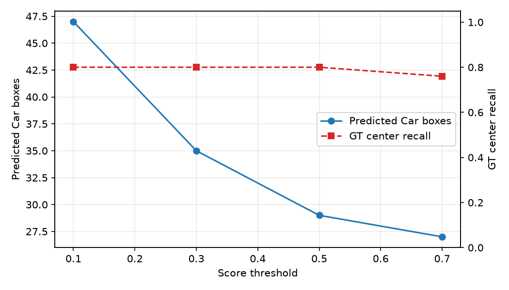
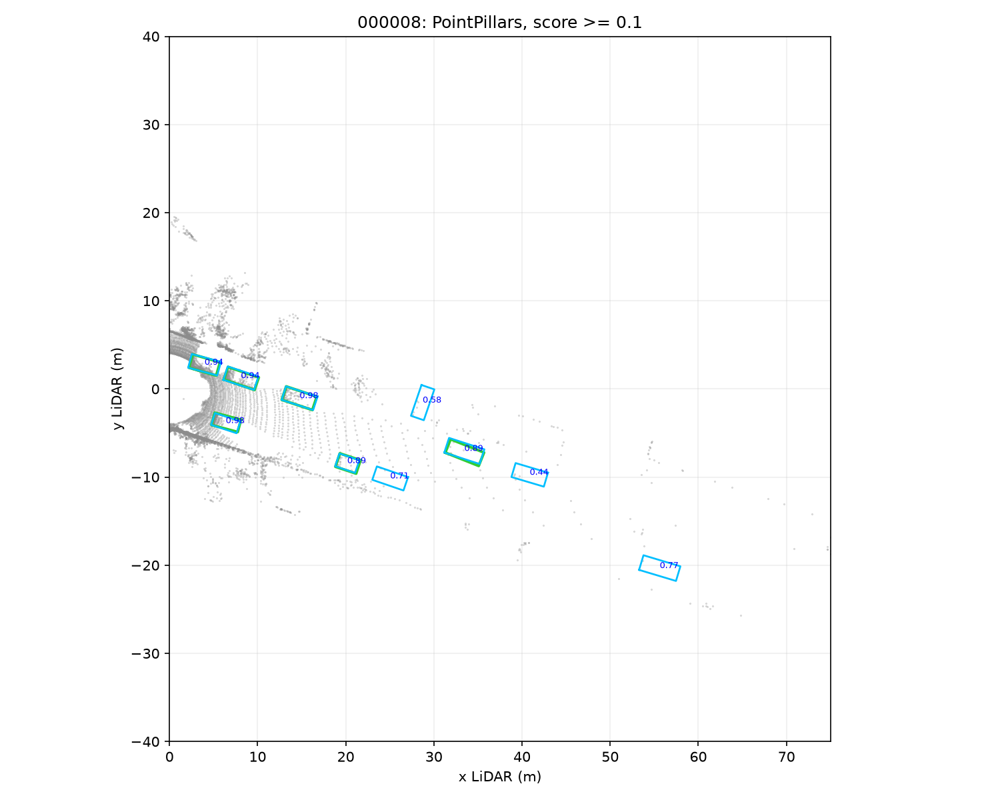
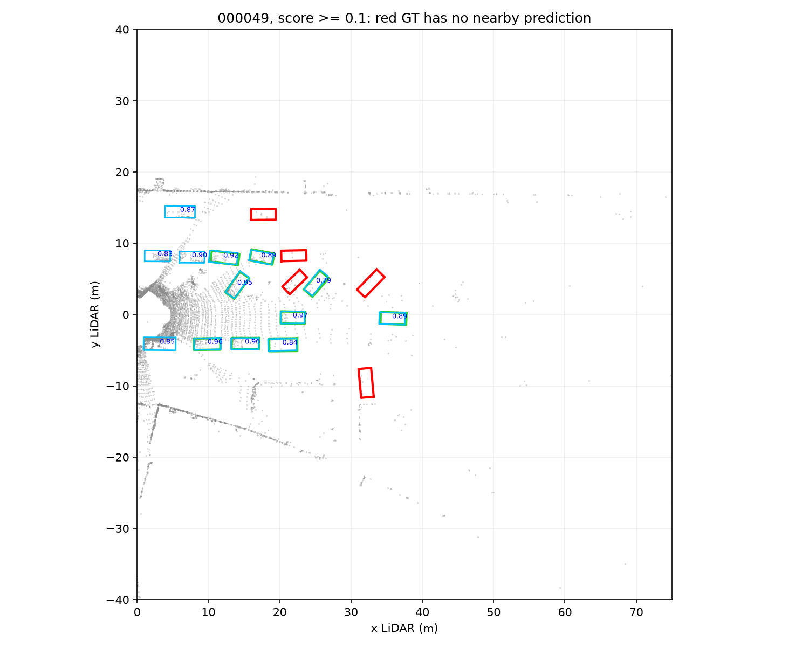

# Báo cáo Day 6: Baseline PointPillars trên KITTI mini

- **Họ tên:** Trần Long Khánh
- **MSSV:** 2A202602538
- **Lớp:** K4A
- **Link repo:** https://github.com/khanhtrankuri/K4-Track4-Day06-3D-From-Point-Clouds
- **Topic:** B — Chạy baseline 3D detector
- **Dataset:** `data/kitti_mini`
- **Các frame đã dùng:** `000001`, `000004`, `000008`, `000011`, `000049`

## 1. Claim

Trên 5 frame KITTI mini, tăng `score_thr` từ 0.1 lên 0.7 làm số box Car giảm ít nhất 40%, đồng thời làm giảm center-recall. Kết quả xác nhận phần số box (47 xuống 27, giảm 42.6%) và center-recall giảm từ 80% xuống 76%.

## 2. Evidence

Đã chạy checkpoint PointPillars KITTI Car bằng MMDetection3D 1.4.0, PyTorch 2.1.0+cu121 trên NVIDIA GeForce RTX 4060 Laptop GPU. Metric ghép một-một GT và prediction theo khoảng cách tâm BEV không quá 2 m; đây là diagnostic metric, không phải KITTI AP.

| `score_thr` | Box Car dự đoán | GT Car được ghép / 25 | Center-recall |
|---:|---:|---:|---:|
| 0.1 | 47 | 20 | 80% |
| 0.3 | 35 | 20 | 80% |
| 0.5 | 29 | 20 | 80% |
| 0.7 | 27 | 19 | 76% |



Ảnh BEV của cả 5 frame nằm tại `results/figures/demo_baseline_bev_<frame>.png`; xanh dương là prediction, xanh lá là GT đã ghép và đỏ là GT bị bỏ sót. Phân bố score nằm ở `results/figures/baseline_score_histogram.png`. Cấu hình cố định: range `[0, -39.68, -3, 69.12, 39.68, 1]` m, voxel `[0.16, 0.16, 4]` m, class `Car`, rotate-NMS IoU 0.01, tối đa 50 box, không dùng camera/sweep. Dữ liệu chi tiết: `results/baseline_threshold_sweep.csv`.



Latency bỏ một warm-up, đồng bộ CUDA trước/sau mỗi lần và đo 20 lần trên frame `000001`: p50 **49.4 ms**, p95 **62.1 ms** (trung bình 51.4 ms). Dữ liệu thô: `results/baseline_latency.csv`.

## 3. Failure case



Ở frame `000049`, ngưỡng thấp nhất 0.1 vẫn chỉ ghép được 9/14 GT Car (64.3%); 5 box GT đỏ không có prediction cách tâm dưới 2 m. Đây là cảnh đông xe và nhiều vật bị che khuất. Failure thuộc lớp **Model**: PointPillars gom toàn bộ chiều cao vào một pillar nên các xe gần nhau/che khuất dễ có đặc trưng chồng lấp; NMS cũng có thể loại các box lân cận. Lớp **Metric** là giới hạn phụ: ghép tâm 2 m không đo IoU/yaw và có thể đánh dấu miss dù box còn giao nhau.

Khi chạy thật, phát hiện failure bằng cách log số box theo khoảng cách và mật độ điểm, theo dõi chuỗi thời gian, và gắn cờ frame đông vật thể có recall proxy thấp để review. Bước tiếp theo là đánh giá KITTI AP và so sánh CenterPoint/SECOND trên cùng tập frame.

## 4. Khuyến nghị nếu triển khai thật

Với ADAS, chọn ngưỡng 0.3–0.5 làm điểm bắt đầu: giảm 25.5–38.3% số box so với 0.1 mà center-recall trên mẫu này vẫn giữ 80%. Không dùng 0.7 nếu ưu tiên tránh bỏ sót vì frame `000001` mất xe xa khoảng 61 m. Cần log p50/p95 latency, số box và score theo range, mật độ điểm trong box, tỷ lệ frame không có detection và tỷ lệ track bị đứt. Benchmark chỉ có 5 frame và metric tâm đơn giản, nên phải đánh giá AP/recall trên tập validation lớn hơn trước khi triển khai.

## 5. Cách chạy lại

```bash
conda run -n vin python tools/verify_data.py --data-root data/kitti_mini
conda run -n vin python -m mim download mmdet3d --config pointpillars_hv_secfpn_8xb6-160e_kitti-3d-car --dest %TEMP%\day6_pointpillars
conda run -n vin python -m src.baseline_detector --config %TEMP%\day6_pointpillars\pointpillars_hv_secfpn_8xb6-160e_kitti-3d-car.py --checkpoint %TEMP%\day6_pointpillars\hv_pointpillars_secfpn_6x8_160e_kitti-3d-car_20220331_134606-d42d15ed.pth --data-root data/kitti_mini --device cuda:0 --repeats 20
conda run -n vin python tools/check_submission.py
```

Checkpoint được tải vào `%TEMP%` và không commit vào repo. Môi trường đã chạy: Python 3.11, PyTorch 2.1.0+cu121, MMCV 2.1.0, MMEngine 0.10.7, MMDetection 3.3.0, MMDetection3D 1.4.0, Transformers 4.38.2.

## 6. Khai báo sử dụng AI

| Công cụ | Dùng cho việc gì | Bạn đã kiểm chứng thế nào |
|---|---|---|
| OpenAI Codex | Đọc yêu cầu, xây script benchmark/visualization, hỗ trợ cài môi trường và phân tích kết quả | Đã chạy inference thật hai lần bằng env `vin`, đối chiếu CSV với ảnh BEV, đo latency 20 lần và chạy `tools/check_submission.py` |
