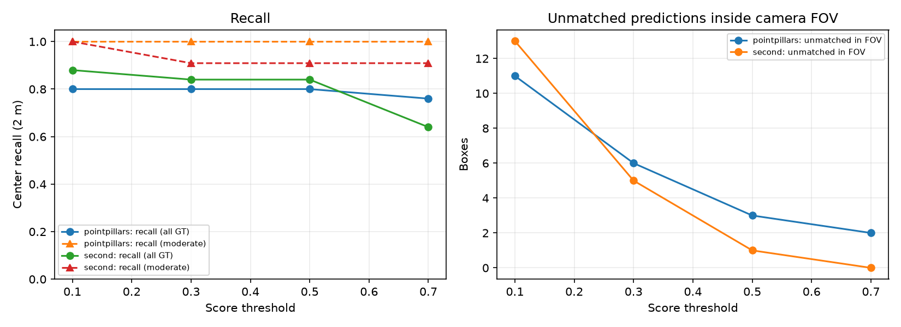
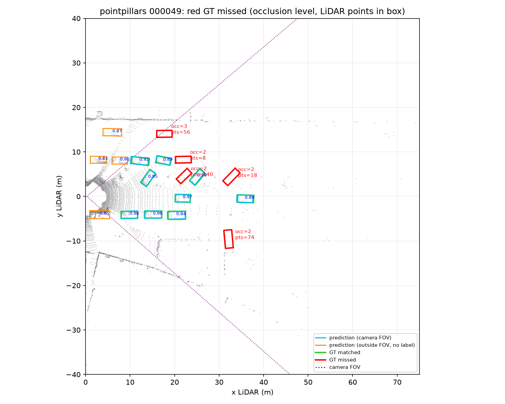
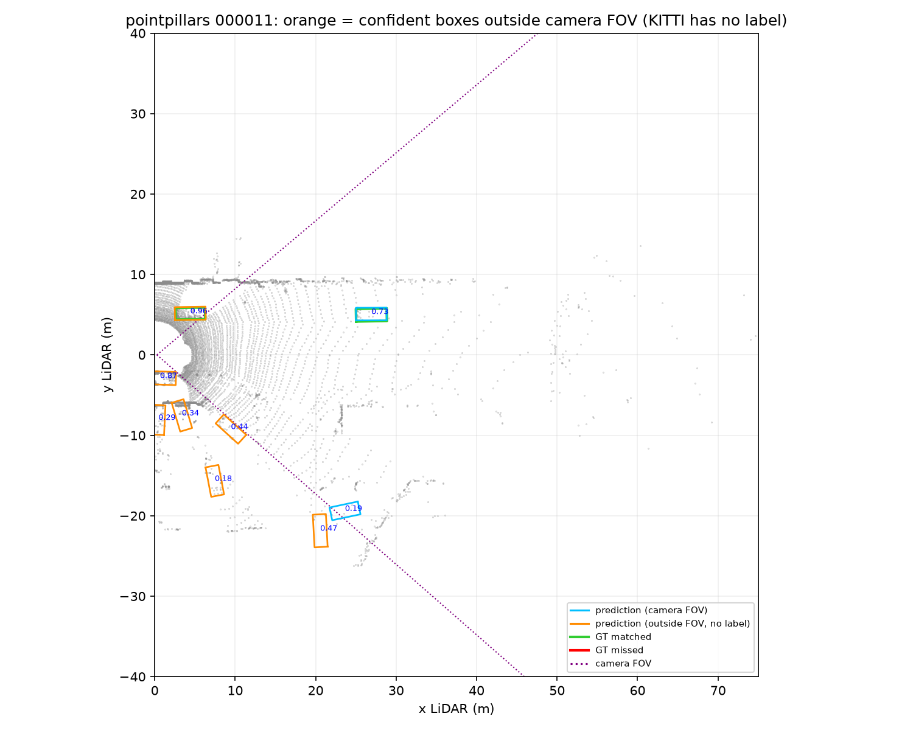
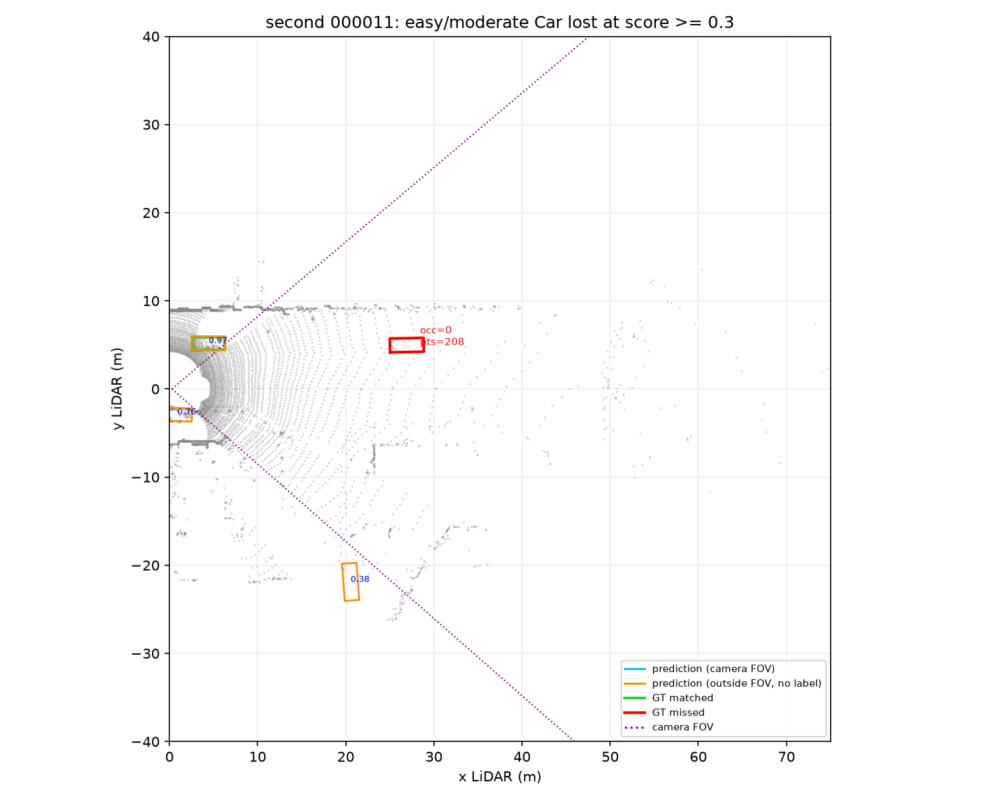

# Báo cáo Day 6: PointPillars và SECOND trên KITTI mini

- **Họ tên:** Trần Long Khánh
- **MSSV:** 2A202602538
- **Lớp:** K4A
- **Link repo:** https://github.com/khanhtrankuri/K4-Track4-Day06-3D-From-Point-Clouds
- **Topic:** B — Chạy baseline 3D detector (mức Advanced: so sánh 2 model, 4 mức `score_thr`)
- **Dataset:** `data/kitti_mini`
- **Các frame đã dùng:** `000001`, `000004`, `000008`, `000011`, `000049` (25 GT Car, 11 thuộc mức KITTI Moderate)

## 1. Claim

Trên 5 frame KITTI mini, với PointPillars, nâng `score_thr` từ 0.1 lên 0.5 loại **73% box thừa trong vùng nhìn camera** (11 xuống 3) mà **không mất GT Car nào** (center-recall giữ 80%; Moderate giữ 100%). SECOND bắt thêm 2 xe bị che khuất mà PointPillars bỏ sót (recall 88% so với 80% ở ngưỡng 0.1), đổi lại **chậm gấp 1.7 lần** (p50 97 ms so với 57 ms). Tất cả xe bị bỏ sót ở ngưỡng 0.1, với cả 2 model, đều bị che khuất nặng (occlusion 2–3).

## 2. Evidence

**Thiết lập.** Dùng checkpoint KITTI Car có sẵn của MMDetection3D 1.4.0, không train lại: PointPillars (`hv_pointpillars_secfpn_6x8_160e_kitti-3d-car`) và SECOND (`second_hv_secfpn_8xb6-80e_kitti-3d-car`). Chạy trên NVIDIA GeForce RTX 4060 Laptop GPU, PyTorch 2.1.0+cu121, seed 42.

**Metric.** GT và prediction được ghép một-một theo khoảng cách tâm BEV, tối đa 2 m. Đây là metric chẩn đoán, không phải KITTI AP.

- *Moderate* theo chuẩn KITTI: chiều cao bbox ít nhất 25 px, occlusion ≤ 1, truncation ≤ 0.3.
- *Box thừa trong FOV*: prediction có tâm chiếu vào ảnh `image_2` nhưng không được ghép với GT nào. Prediction ngoài FOV không được tính, vì KITTI chỉ gán nhãn trong vùng camera nhìn thấy (xem failure 2).

Detection cho cùng kết quả khi chạy lại 3 lần. Riêng latency dao động khoảng ±5 ms giữa các lần chạy.

| Model | `score_thr` | Box trong FOV | Box thừa trong FOV | GT ghép / 25 | Recall (all) | Recall (Moderate, 11) |
|---|---:|---:|---:|---:|---:|---:|
| PointPillars | 0.1 | 30 | 11 | 20 | 80% | 100% |
| PointPillars | 0.3 | 25 | 6 | 20 | 80% | 100% |
| PointPillars | 0.5 | 22 | 3 | 20 | 80% | 100% |
| PointPillars | 0.7 | 20 | 2 | 19 | 76% | 100% |
| SECOND | 0.1 | 34 | 13 | 22 | 88% | 100% |
| SECOND | 0.3 | 25 | 5 | 21 | 84% | 91% |
| SECOND | 0.5 | 21 | 1 | 21 | 84% | 91% |
| SECOND | 0.7 | 15 | 0 | 16 | 64% | 91% |



**Latency.** Bỏ 1 lần warm-up, đo 20 lần trên frame `000001`, có `torch.cuda.synchronize()` trước và sau mỗi lần. Đo 2 kiểu: đọc file `.bin` từ đĩa (end-to-end), và truyền mảng điểm đã nạp sẵn trong RAM.

| Model | File p50 / p95 (ms) | In-memory p50 / p95 (ms) |
|---|---:|---:|
| PointPillars | 59.4 / 71.0 | 57.2 / 59.3 |
| SECOND | 97.6 / 112.7 | 97.2 / 99.9 |

Đọc file chỉ thêm khoảng 2 ms ở p50, nhưng làm p95 tăng mạnh (59 lên 71 ms với PointPillars). Phần jitter này đến từ I/O chứ không phải model.

**Config đã đọc** (lưu đầy đủ trong `results/<model>_config.json`):

- Range: PointPillars `[0, -39.68, -3, 69.12, 39.68, 1]` m, SECOND `[0, -40, -3, 70.4, 40, 1]` m, đều chỉ phía trước xe.
- Voxel: PointPillars `[0.16, 0.16, 4]` m, tức 1 pillar chiếm cả chiều cao. SECOND `[0.05, 0.05, 0.1]` m, tức voxel 3D.
- Class `Car`, rotate-NMS IoU 0.01, tối đa 50 box, không dùng sweep hay camera.

**Kiểm tra calibration.** Hai hàm TODO trong `starter/projection.py` đã được viết. Overlay của frame KITTI `000011` cho thấy điểm LiDAR khớp với người và xe, không có điểm nào trên trời: `results/figures/overlay_000011_*.png`. Đã chạy thêm overlay cho synthetic và nuScenes.

**Ảnh và dữ liệu.**

- BEV của từng frame: `results/figures/<model>_bev_<frame>.png`. Màu: xanh dương là prediction trong FOV, cam là prediction ngoài FOV, xanh lá là GT đã ghép, đỏ là GT bị bỏ sót, đường tím chấm là biên FOV.
- Phân bố score: `results/figures/<model>_score_histogram.png`.
- Số liệu thô: `results/<model>_threshold_sweep.csv`, `results/<model>_gt_analysis.csv`, `results/model_comparison.csv`.

## 3. Failure case

**Failure 1: xe bị che khuất nặng bị bỏ sót.** Lớp chính là **Model**, có thêm giới hạn từ cảm biến.



Ở frame `000049`, một cảnh đông xe, PointPillars bỏ sót 5/14 GT ngay cả ở ngưỡng 0.1. Theo `results/pointpillars_gt_analysis.csv`, **cả 5 xe đều có occlusion 2–3** và số điểm LiDAR trong box lần lượt là 140, 74, 56, 18 và 8. Trong khi đó, **cả 11 xe Moderate đều được phát hiện.** Có 2 nguyên nhân khác nhau:

- **Xe có 8–18 điểm:** tia laser bị xe phía trước chặn lại. Đây là giới hạn của cảm biến, model nào cũng khó phát hiện. SECOND cũng bỏ sót cả 2 xe này.
- **Xe có 56–140 điểm:** vẫn đủ điểm, nhưng PointPillars gom toàn bộ chiều cao vào một pillar 0.16 m. Hình dạng của một chiếc xe bị che một nửa vì vậy bị nén mất. **SECOND dùng voxel 3D 0.1 m theo chiều cao và bắt được 2 trong 3 xe này** (140 và 56 điểm), nên recall tăng từ 80% lên 88%. Điều này cho thấy nguyên nhân là cách biểu diễn của model, không phải do thiếu dữ liệu.

**Failure 2: box "thừa" thật ra là xe nằm ngoài vùng có nhãn.** Lớp **Metric**, do quy ước gán nhãn của dataset.



Ở ngưỡng 0.1, PointPillars có 17/47 box nằm ngoài FOV camera (box màu cam), nhiều box có score 0.83–0.90 và nằm sát ego. Đây nhiều khả năng là xe thật đang đỗ bên đường, nhưng KITTI chỉ gán nhãn trong vùng ảnh `image_2`. Nếu đếm cả các box này là false positive, ta sẽ đánh giá thấp precision và chọn ngưỡng sai. Vì vậy bảng ở mục 2 chỉ tính box thừa trong FOV.

Hạn chế còn lại: bộ lọc FOV dựa trên tâm box, nên một xe bị cắt ở mép ảnh (frame `000011`, truncation 1.0) vẫn bị xếp là ngoài FOV dù có nhãn.

**Failure 3, riêng của SECOND: xe rõ ràng có score thấp.** Lớp **Model**, do calibration score.



Ở frame `000011`, một xe không bị che, cách 27 m, có 208 điểm, nhưng SECOND chỉ cho score trong khoảng 0.1–0.3. Vì vậy ở ngưỡng 0.3, recall Moderate của SECOND tụt xuống 91%, trong khi PointPillars vẫn bắt được xe này với score 0.73. Như vậy cùng một ngưỡng không áp dụng chung được cho 2 model: phải chọn ngưỡng riêng cho từng model.

**Failure 4, khi cài đặt: SECOND nạp sai trọng số mà không báo lỗi.** Lớp **I/O**.

Checkpoint SECOND lưu trọng số sparse conv theo layout của spconv2, là `(out, k, k, k, in)`. Môi trường này không cài spconv, nên mmcv cần layout `(k, k, k, in, out)`. MMDetection3D chỉ in cảnh báo `size mismatch`, sau đó model vẫn chạy nhưng **ra 0 box ở mọi frame**. Đã sửa bằng `src/convert_spconv_checkpoint.py`, chuyển vị 12 tensor.

**Cách phát hiện khi chạy thật:**

- Log số điểm trong mỗi box và tỷ lệ box có ít hơn 20 điểm; cảnh đông xe với nhiều box ít điểm là dấu hiệu recall sẽ giảm.
- Gắn cờ frame mà số detection tụt mạnh so với frame liền trước, khi track bị đứt.
- Khi khởi động hệ thống, chạy smoke test trên 1 frame mẫu: nếu ra 0 box thì dừng, đây là cách bắt được failure 4.
- Khi đánh giá, chỉ tính FP trong vùng có nhãn.

## 4. Khuyến nghị nếu triển khai thật

**Use-case:** ADAS phát hiện xe phía trước để cảnh báo va chạm và hỗ trợ ACC, chạy trên GPU nhúng với LiDAR 10 Hz, nên ngân sách khoảng 100 ms mỗi frame cho toàn bộ pipeline.

- **PointPillars ở ngưỡng 0.5** là cấu hình chính. p95 59 ms (in-memory) để lại khoảng 40 ms cho tracking và planning. So với ngưỡng 0.1, nó giảm box thừa trong FOV từ 11 xuống 3 mà không mất xe nào. Không nên dùng 0.7: ở ngưỡng này mất xe xa 61 m ở frame `000001`, mà xe xa chính là thứ ACC cần thấy sớm.
- **SECOND** bắt xe bị che tốt hơn, là đúng loại xe hay bất ngờ lao ra trong cảnh đông. Nhưng p95 112 ms (end-to-end) đã vượt ngân sách 10 Hz trên GPU laptop. Chỉ nên dùng khi phần cứng mạnh hơn, hoặc chạy offline để tạo nhãn tự động.
- **Đánh đổi an toàn:** ngưỡng thấp thì nhiều phanh giả, ngưỡng cao thì bỏ sót. Với xe bị che, nên dùng tracking để giữ lại object qua vài frame, thay vì hạ ngưỡng chung.
- **Cần log khi chạy thật:**
  - latency p50, p95 và p99, tách riêng I/O và model;
  - số box theo khoảng cách;
  - histogram score;
  - số điểm trong mỗi box;
  - tỷ lệ frame không có detection;
  - tỷ lệ track bị đứt;
  - cảnh báo `size mismatch` khi nạp model.
- **Hạn chế của thí nghiệm:** chỉ có 5 frame, 25 GT, và metric là ghép theo tâm, chưa đo IoU hay yaw. Trước khi triển khai phải chạy KITTI AP trên toàn bộ tập val khoảng 3.7k frame.

## 5. Cách chạy lại

Cần một môi trường có GPU NVIDIA với: Python 3.11, PyTorch 2.1.0+cu121, MMCV 2.1.0, MMEngine 0.10.7, MMDetection 3.3.0, MMDetection3D 1.4.0 và openmim. Không cần cài spconv. Môi trường của tôi là conda env `vin`: chạy `conda activate vin` trước. Các lệnh dưới đây chạy được cả trong PowerShell và bash, tính từ thư mục gốc của repo. Checkpoint được tải vào `checkpoints/`, thư mục này đã nằm trong `.gitignore`.

```bash
python tools/verify_data.py --data-root data/kitti_mini
python -m mim download mmdet3d --config pointpillars_hv_secfpn_8xb6-160e_kitti-3d-car --dest checkpoints
python -m mim download mmdet3d --config second_hv_secfpn_8xb6-80e_kitti-3d-car --dest checkpoints
python -m src.convert_spconv_checkpoint --src checkpoints/second_hv_secfpn_8xb6-80e_kitti-3d-car-75d9305e.pth --dst checkpoints/second_kitti_car_mmcv.pth
python -m src.baseline_detector --tag pointpillars --config checkpoints/pointpillars_hv_secfpn_8xb6-160e_kitti-3d-car.py --checkpoint checkpoints/hv_pointpillars_secfpn_6x8_160e_kitti-3d-car_20220331_134606-d42d15ed.pth
python -m src.baseline_detector --tag second --config checkpoints/second_hv_secfpn_8xb6-80e_kitti-3d-car.py --checkpoint checkpoints/second_kitti_car_mmcv.pth
python -m src.compare_models
python -m starter.projection --data-root data/kitti_mini --frame 000011
python tools/check_submission.py
```

**Tool dùng lại được:** cả 3 script trong `src/` đều có tham số dòng lệnh và `--help`.

- `baseline_detector.py` chạy được với mọi checkpoint KITTI Car của MMDetection3D. Có thể đổi `--frames`, `--thresholds`, `--max-center-distance` và `--repeats`.
- `compare_models.py --tags a b c` gộp kết quả của nhiều model.
- `convert_spconv_checkpoint.py` sửa layout trọng số cho mọi model dùng sparse conv, ví dụ SECOND, PV-RCNN hay CenterPoint, khi môi trường không có spconv.

## 6. Khai báo sử dụng AI

| Công cụ | Dùng cho việc gì | Bạn đã kiểm chứng thế nào |
|---|---|---|
| OpenAI Codex | Đọc yêu cầu, viết bản đầu của script benchmark và visualization, hỗ trợ cài môi trường, phân tích kết quả ban đầu | Đã chạy inference thật bằng env `vin`, đối chiếu CSV với ảnh BEV, chạy `tools/check_submission.py` |
| Claude Code (Anthropic) | Review repo theo rubric. Viết 2 hàm TODO projection. Thêm lọc FOV, metric Moderate, bảng phân tích GT (occlusion, số điểm trong box), latency 2 kiểu, so sánh với SECOND, script chuyển checkpoint spconv. Viết lại REPORT | Tự kiểm `velo_to_cam` (điểm (10, 0, 0) cho z_cam ≈ 9.7) và xem overlay. Chạy lại cả 2 model 3 lần: số detection giống hệt nhau. Đối chiếu từng GT bị bỏ sót với `label_2/000049.txt` và ảnh `fail_*.png` |
